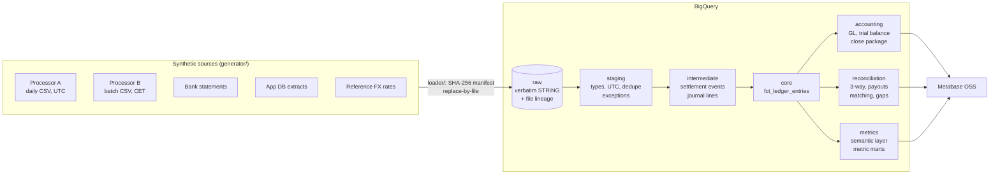

# Kiln: settlement-to-ledger

**All data in this repository is synthetic.** Kiln is a fictional
creator-commerce platform, and both payment processors are fictional. No real
company, person, logo or transaction appears anywhere.

An analytics engineering case study for strategic finance. It takes messy
payment-processor settlement files and builds them into a double-entry
ledger. Accounting policy (revenue, FX, bad debt) is encoded in dbt. Every
number is reconciled back to the processor, the bank and the app database.
On top of that sit a semantic layer and Metabase dashboards for the month-end
close and unit economics.

## The problem

Kiln sells creators' digital products and takes a platform fee. Money moves
through two processors that disagree with each other and with Kiln:

- **Processor A** sends daily CSVs in UTC. It re-sends rows, restates fees and
  sometimes sends a truncated line.
- **Processor B** sends batch files in Central European time with decimal
  commas, and one batch never arrives.
- **Kiln's app database** has orders no processor settled, and the processors
  have charges for orders Kiln has never heard of.
- **Three currencies with no decimals in one of them.** USD, EUR and JPY
  settle at rates different from Kiln's booking rate.

Finance needs a close it can trust: a ledger that balances, revenue booked
correctly (Kiln is an agent, so revenue is the fee, not the order value),
every break explained, and metrics that tie to the ledger.

## Architecture



| Layer | What it guarantees |
|---|---|
| **Loader** | Every file lands once (SHA-256 manifest). A re-sent file replaces its earlier version. Rows that can't be parsed go to `load_exceptions` with the line number and the raw text. Raw is a faithful copy of what arrived. |
| **Staging** | Typed, deduplicated, timestamps in UTC (original timezone kept). Money as integer minor units with a currency code; JPY has 0 decimals. Bad values go to `stg_exceptions` with a reason. |
| **Ledger** | Double entry in USD cents. Every journal entry sums to zero, and so does every period. Realized FX is the balancing line on each settlement. Unrealized FX remeasures EUR balances at month-end. A bad-debt allowance is booked for seller balances negative 90+ days. |
| **Reconciliation** | Orders ↔ settlements, processor payouts ↔ bank, daily processor ↔ ledger ↔ bank, and batch-number gaps. |
| **Metrics** | 14 metrics defined once in the dbt semantic layer. The marts that Metabase reads are tested to tie to ledger accounts to the cent. |

## Non-negotiables, and how they're enforced

| Rule | Enforcement |
|---|---|
| Money is never a float | Integer minor units end to end; `to_minor_units` and `to_usd_minor` macros |
| UTC from staging on | Staging converts; original timezone column kept; month-end boundary test |
| Every raw row lands in the ledger exactly once, or in exceptions with a reason | `assert_processor_{a,b}_rows_land_exactly_once`, `assert_every_settlement_event_is_posted` |
| The ledger balances per journal entry and per period | `sums_to_zero` tests, `assert_balance_sheet_balances` |
| Accounting policy is configuration | `bad_debt_aging_days`, `fx_rate_source`, `recon_tolerance_minor`, `ledger_lookback_days` are dbt vars |

## Proving it: the answer key

The generator records every problem it plants, row by row, in
`data/truth/expected_issues.json`. CI builds the whole pipeline in a
throwaway BigQuery dataset on every PR. Then `scripts/check_issue_coverage.py`
checks the warehouse against the answer key, issue by issue and by row ID.
Nothing may disappear silently: **17 of 17 checks pass**. The planted problems
are listed in [DATA_ISSUES.md](DATA_ISSUES.md).

| | Small (CI, every PR) | Full |
|---|---|---|
| Period | Jun–Sep 2025 | Apr 2024–Sep 2025 |
| Orders | ~1,300 | 353,389 |
| Sellers | | 2,661 |
| dbt models / tests | 36 / 64 | 36 / 64 |

## Key decisions

All 45 decisions, with the options considered, are in
[DECISIONS.md](DECISIONS.md). The ones that matter most:

- **Kiln is an agent, so revenue is the platform fee** (ASC 606). GMV is a
  volume metric, and the seller's share is a liability (026).
- **Raw lands as text.** A malformed row is the only copy of that
  transaction, so it is kept and routed to exceptions, never dropped.
- **Realized FX is the balancing line.** It is computed as the gap between
  Kiln's booking rate and the rate the processor actually paid, not from a
  second rate table.
- **Metrics live in the semantic layer and are materialized for Metabase**,
  because Metabase OSS can't query the dbt semantic layer (041).
- **CI is keyless.** GitHub Actions authenticates to GCP through Workload
  Identity Federation, so no service-account key exists for CI.

## Metrics and dashboards

Definitions, grain, owner and accounting-vs-product are in
[METRICS.md](METRICS.md). Dashboards are code in [metabase/](metabase/)
and run on free, self-hosted Metabase OSS:

- **Finance close:** trial balance check, income statement, three-way recon
  status, payout recon, unmatched orders, missing batches, FX, bad debt.
- **Unit economics:** GMV, take rate, contribution margin by region, processor
  and plan, refund and dispute rates, seller retention and NRR by cohort.

## Running it

```bash
uv sync && uv run pre-commit install
export GCP_PROJECT_ID=<your-project>
gcloud auth application-default login
export DBT_DATASET=kiln_dev   # raw lands in <DBT_DATASET>_raw

uv run python -m generator --scale small   # or: --scale full --seed 7
uv run python -m loader load
uv run python -m loader verify
cd transform && uv run dbt build --profiles-dir .
cd .. && uv run python scripts/check_issue_coverage.py
```

The full-scale build into the persistent `kiln_*` datasets is a manual
GitHub Actions workflow (`full-build`). Dashboard setup is in
[metabase/README.md](metabase/README.md).

### Cost controls

BigQuery is the only paid service, and this project runs at roughly zero
cost:

- A custom quota of 30 GiB of query usage per day.
- `maximum_bytes_billed` on every dbt profile.
- A budget alert.
- CI datasets dropped at the end of every run.

GCP setup is one script ([`scripts/setup_gcp_wif.sh`](scripts/setup_gcp_wif.sh)).

## Layout

```
generator/   seeded synthetic data generator with an answer key
loader/      idempotent raw-file loader (SHA-256 manifest, replace-by-file)
transform/   dbt: staging -> intermediate -> marts (core, accounting,
             reconciliation, finance, metrics)
metabase/    dashboards as code + Docker setup
scripts/     GCP setup, CI runner, answer-key and docs coverage checks
tests/       Python tests (generator, loader, CI recovery, dashboards)
```

## If this were real: the first 90 days

1. **Days 1–30: trust the close.** Run the reconciliation against real
   processor files. Agree the break tolerance and the owner for each break
   type with the controller. Make the trial balance check a hard gate on the
   close.
2. **Days 31–60: one set of numbers.** Move the metric definitions finance and
   product argue about (take rate, contribution, retention) into the
   semantic layer. Give each an owner, and retire the spreadsheet versions.
3. **Days 61–90: forward-looking.** Feed the monthly unit economics into the
   planning model. Add a dispute and bad-debt early-warning view per seller,
   and alert on reconciliation breaks daily instead of at month-end.
